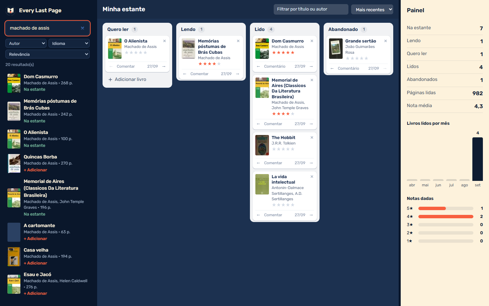
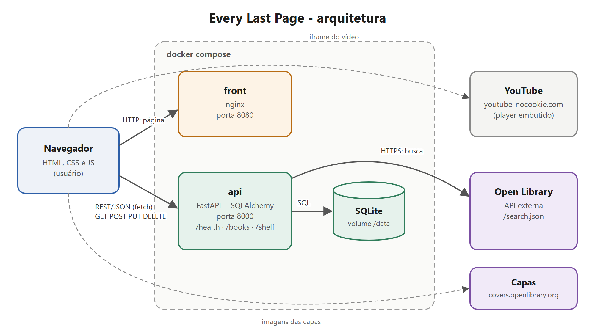

# Every Last Page

Estante de leitura no navegador, organizada como um quadro. Três colunas: à esquerda, a busca de
livros reais na [Open Library](https://openlibrary.org), com filtros de campo, idioma e ordem; no
centro, o quadro da estante, com uma lista por status (Quero ler, Lendo, Lido e Abandonado); à
direita, o painel com os números da leitura. Cada livro tem status, nota de 1 a 5 e um comentário.

Este é o repositório principal. A API própria está em
[every-last-page-api](https://github.com/Renanarauujo/every-last-page-api).



## Arquitetura



| Componente | Tecnologia | Papel |
|---|---|---|
| Front (este repositório) | HTML, CSS e JavaScript puro, servido por nginx | Interface; chama a API por REST/JSON |
| API própria | Python, FastAPI, SQLAlchemy | CRUD da estante, regras de status e busca na Open Library |
| Banco | SQLite em volume Docker | Guarda a estante entre reinícios |
| API externa | Open Library | Catálogo de livros e capas |

O front nunca chama a Open Library para buscar livros: a API própria faz a busca e devolve os
dados tratados. O navegador carrega da Open Library só as imagens das capas.

## Como executar

Pré-requisitos: [Git](https://git-scm.com) e [Docker](https://www.docker.com) com Docker Compose.

1. Clone os dois repositórios na mesma pasta:

   ```bash
   git clone https://github.com/Renanarauujo/every-last-page-api
   git clone https://github.com/Renanarauujo/every-last-page-front
   ```

2. Suba tudo a partir da pasta do front:

   ```bash
   cd every-last-page-front
   docker compose up --build
   ```

3. Abra:
   - Aplicação: http://localhost:8080
   - API e Swagger: http://localhost:8000/docs

A estante fica no volume `shelf-data` e continua lá depois de `docker compose down`. Para apagar
tudo, use `docker compose down -v`.

## O que a tela faz

| Ação | Chamada à API |
|---|---|
| Buscar livros pelo botão Pesquisar (ou Enter), filtrando por campo (título, autor, ISBN), idioma e ordem | `GET /books/search?q=&field=&language=&sort=` |
| Adicionar à estante | `POST /shelf` |
| Mostrar o quadro com as listas Quero ler, Lendo, Lido e Abandonado, com filtro por texto e ordenação | `GET /shelf?order=` |
| Arrastar o cartão para outra lista (ou usar ← e →) e dar nota nas estrelas do cartão | `PUT /shelf/{id}` |
| Abrir o cartão na ficha do livro (janela): trocar o status, dar nota, editar as datas de início e conclusão e escrever o comentário | `PUT /shelf/{id}` |
| Remover da estante pelo × do cartão ou pela ficha | `DELETE /shelf/{id}` |
| Painel: contagem por status, páginas lidas, nota média, livros lidos por mês e distribuição das notas | `GET /shelf/summary` |

A busca roda pelo botão Pesquisar ou pelo Enter, cancela a busca anterior ainda em andamento e
guarda os resultados já vistos, para não repetir chamadas. Cada chamada mostra o estado
(carregando, sucesso ou erro). A largura das três colunas se ajusta
arrastando os divisores entre elas, com limites para o quadro nunca ficar estreito demais; a escolha
fica salva no navegador, e o duplo clique no divisor volta ao padrão. A interface usa as cores do ícone do
projeto (azul-marinho, branco e coral) e a fonte [Rubik](https://github.com/googlefonts/rubik)
(licença SIL Open Font License, em `fonts/OFL.txt`), servida pelo próprio front.

## API externa: Open Library

A [Open Library](https://openlibrary.org) é um catálogo aberto de livros mantido pelo
Internet Archive.

- **Licença:** o Internet Archive não reivindica direitos autorais sobre os dados do catálogo
  ([licensing](https://openlibrary.org/developers/licensing)). O projeto usa os dados apenas para
  exibição e guarda uma cópia de título, autor, páginas e id da capa dos livros adicionados.
- **Cadastro:** não é necessário. A API é gratuita e não exige chave; o projeto se identifica
  pelo cabeçalho `User-Agent`, como a [documentação](https://openlibrary.org/developers/api)
  recomenda.
- **Limites:** a documentação indica até 1 requisição por segundo sem identificação. A API
  própria limita a 60 buscas por minuto por IP.

Rotas usadas:

| Rota | Uso |
|---|---|
| `GET https://openlibrary.org/search.json?q=&limit=&fields=key,title,author_name,number_of_pages_median,cover_i` | [Search API](https://openlibrary.org/dev/docs/api/search): busca de livros, chamada pela API própria |
| `GET https://covers.openlibrary.org/b/id/{cover_id}-{S,M}.jpg` | [Covers API](https://openlibrary.org/dev/docs/api/covers): imagem da capa, carregada pelo navegador |

## Estrutura

```
index.html          estrutura da página
css/style.css       tema e layout
js/main.js          inicialização
js/config.js        endereço da API
js/api.js           chamadas à API
js/dom.js           criação de elementos sem innerHTML
js/toast.js         mensagens de carregando, sucesso e erro
js/state.js         estado da estante e nomes dos status
js/icons.js         ícones em SVG
js/layout.js        largura ajustável das colunas
js/search.js        busca com filtros e adição
js/board.js         quadro, cartões e arrastar e soltar
js/sheet.js         ficha do livro em janela
js/panel.js         painel
img/logo.png        ícone do projeto
fonts/              fonte Rubik (woff2) e licença
nginx.conf          servidor e headers de segurança
Dockerfile          imagem do front (nginx)
docker-compose.yml  front + API + volume do banco
docs/               fluxograma e captura de tela
```

## Segurança

- Todo dado externo entra na página com `textContent`, nunca com `innerHTML`.
- A URL da capa é montada a partir de um número vindo da API.
- O nginx envia `Content-Security-Policy` restrita às origens usadas, `X-Frame-Options`,
  `X-Content-Type-Options`, `Referrer-Policy` e `Permissions-Policy`.
- A API aceita chamadas apenas da origem do front (CORS por lista).
